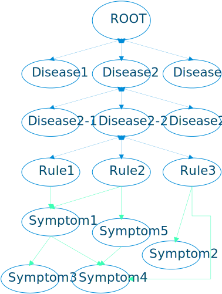
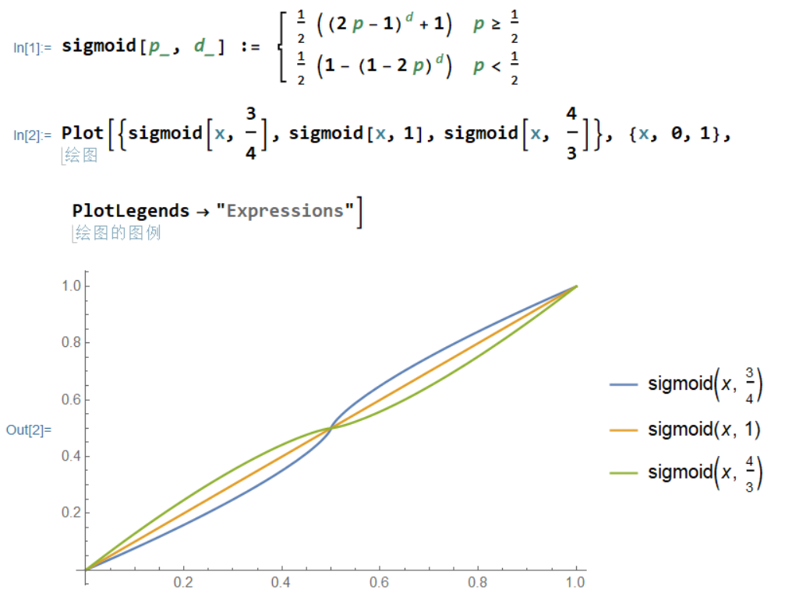

## 项目结构介绍

项目结构如下
```
root
|--doc
|--project
|   |--graph
|   |   |--*
|   |--resources
|   |   |--*
|   |--treatment
|   |   |--*
|   |--dapi.py
|--main.py
|--README.md
```

- `doc`目录下为抑郁症相关的文档
- `project`为整个项目所在目录
    + `graph`为疾病诊断模块
    + `treatment`为治疗方案给出模块
    + `resources`为整个项目用到的关于抑郁症的数据资源
    + `dapi.py`为API封装模块，该模块封装了整个项目的API供外界调用
- `main.py`为一个演示demonstration。
- `README.md`即该说明文档

## 疾病诊断模块

### 节点介绍

该模块下类的继承关系如下：
```
Node
  |--ComputableNode
      |--DiseaseNode
      |--RuleNode
      |--SymptomNode
```

他们在`dapi.py`文件的`Graph`类中的数据结构的组织方式如下：
```
root(Disease)
 |-Disease1
   |-subDisease1-1
   |-subDisease1-2
     |-Rule1
       |-Symptom1
         |-subSymptom1-1
          |-subSymptom1-1-1
         |-subSymptom1-2
       |-Symptom2
     |-Rule2
 |-Disease2
   |-subDisease2-1
 |-Disease3
   |-subDisease3-1
```

1. `root`节点为一个`DiseaseNode`实例对象
2. `root`节点的子节点也是由`DiseaseNode`实例构成
3. 对于顶层（即root的下一层，整个模型处理过程忽略root的存在）的`DiseaseNode`实例，可能还有子疾病，即存在子节点也是`DiseaseNode`实例。
4. 但是第二层疾病实例目前不存在子疾病，其子节点由`RuleNode`实例构成，即用于计算该疾病概率的规则节点。
5. 规则节点一般会包含一些症状作为子节点。
6. 症状子节点可能还有子症状作为其子节点，且这个层度是不确定的。

有以下几点需要注意：
1. `root`到疾病的引用是**双向**的
2. 疾病到子疾病的引用是**双向**的
3. （子）疾病到规则的引用是**双向**的
4. 规则到（子）症状的引用是**单向**的
5. 症状到子症状的的引用是**单向**的



因为规则节点对症状节点的引用完全是任意的，所以整个数据结构不再是一棵树，而是一张图，由于存在单向引用，所以这是一张有向图。

### 诊断算法

1. 假设我们要对上图的`Disease2`节点求其综合概率，则它会递归对所有子节点求综合概率。

    > 这里将概率设定为词义相似度，即调用者设定的值，比如用户说"我不想活了"，假设自然语言处理以后映射的症状为"自杀"，且这个"自杀"这个词和"不想活"这个词的相似度为0.8，则这个症状的概率就设定为0.8。综合概率是该模型通过对所有子节点的递归计算得出的该节点成立的概率值，如果该节点为疾病节点，则就表示用户患有该疾病的最终概率。

2. 其中症状节点对综合概率值的计算方法为：返回所有子节点和当前节点`sigmoid(p,d)`的最大值。

    > `sigmoid(p,d)`函数为一个激活函数，p为当前症状的概率值，如果当前症状有否定词描述，则p为(1-当前症状的概率值)，d为程度词副词，浅程度d&gt;1，正常程度d=1，深程度d&lt;1。

    `sigmoid(p, d)`的具体定义和图像如下：

    

3. 规则节点对综合概率值的计算方法为：求所有子节点中综合概率大于等于0.5的综合概率的平均值`mean`，返回`mean * ( f(x,u) + 0.6 )`作为该规则节点的综合概率。传入的`x`为子节点中综合概率大于等于0.5的节点的个数，传入的`u`为规则规定的最少需要满足的症状数，比如 **轻度抑郁发作** 中有一条规则为至少满足 **抑郁发作——核心症状** 中的两条，这里`u=2`。

    > `f(x, u)`是期望值为u、标准差为1的正态分布的概率密度函数在x点处的值。

4. 疾病节点的综合概率的计算方法为：若该疾病节点有规则子节点，则返回规则子节点的综合概率的平均值，若没有规则子节点但有子疾病节点，则返回子疾病节点的最大值，否则返回0。


## 治疗方案给出模块

治疗方案给出模块相对简单，拿到疾病诊断节点的最优可能患的疾病以后，在治疗方案中搜寻相关的治疗方案输出即可。再搜索的过程中可能还会调用诊断模块判断用户时候患有某一疾病或症状，因为有些治疗方法依赖特点的症状。